  

  
  
  

## 안녕하세요, bokjk입니다. / Hello, I’m bokjk.

Practical software를 만들며 자동화가 반복적인 일을 덜어 주는 방식을 탐구합니다. I work across full-stack development and enjoy turning ideas into useful tools—especially where agentic/AI development, developer tooling, and document/data automation meet.

  
  
  
  
  
  
  

## Pinned repositories

  
  
  
  
  
  

## Signal board

  
  

  

  

## Contribution current

<picture>
  <source media="(prefers-color-scheme: dark)" srcset="https://raw.githubusercontent.com/bokjk/bokjk/output/github-contribution-grid-snake-dark.svg" />
  <source media="(prefers-color-scheme: light)" srcset="https://raw.githubusercontent.com/bokjk/bokjk/output/github-contribution-grid-snake.svg" />
  
</picture>

Build with intent. Automate the friction. Keep shipping.

